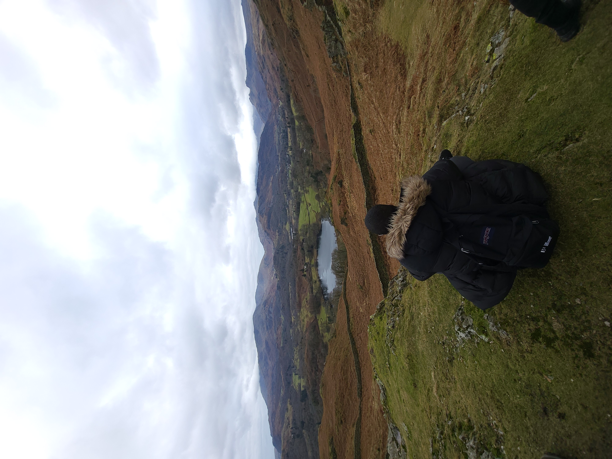

Hi there, I'm Abbas Gure 👋

  
💼 A fullstack engineer and C# enthusiast who likes to dabble in a few frontend technologies from time to time such as React
 
🔭 Currently working on improving my personal website where I plan to showcase my portfolio, travel, and potentially weight loss log and other random stuff that comes to mind. 
 
🌱 Developing a scalable management system to manage balances, resources, and investments. Using it as an opportunity to gain intimate understanding of current APIs such as Stripe, as well as how we integrate into them, along with design patterns, testing methodologies, and Networking.
 
 
[Check out my website!](https://gure.co.uk)
 
 
<h3>🛠 Tech Stack</h3>
💻 &nbsp; C# | Java | TypeScript
 
🌐 &nbsp; HTML | CSS | React | .Net 
 
🛢  &nbsp; MySQL | Postgres | MongoDB 
 
🔧 &nbsp; Visual Studio | VSCode | Git 
 
☁️ &nbsp; Azure | AWS | Docker 
 
🎯 &nbsp; Mockito | Unit | Integration
 
📅 &nbsp; Confluence | Jira 
 
📶 &nbsp; CCNA | MCSA | CompTIA | UNIX
